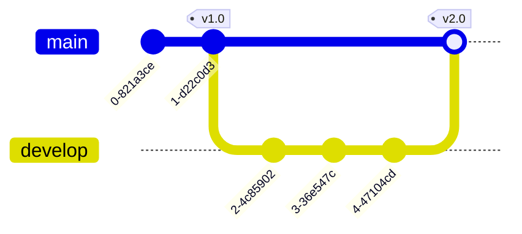

# Markdown

- [Markdown](#markdown)
  - [文構造](#文構造)
  - [強調](#強調)
  - [リンク](#リンク)
  - [リスト](#リスト)
  - [表](#表)
  - [ブロッククオート](#ブロッククオート)
  - [数式](#数式)
  - [コード](#コード)
  - [Mermaid](#mermaid)

*Markdown*とは, 文書を記述するためのマークアップ言語である. 容易に HTML を生成することができ, コードとの親和性が高いことから, 様々な技術文書に用いられる. そのため重要である.

Markdown にはいくつかの方言があり, その方言がどのように解釈されうるかは解釈する系によって異なる. 実際それはコンバータの実装の問題であり, どのように拡張するかは開発者の趣味の問題である.したがって, ある Markdown の記法がある環境では表示できないという問題が起こりうる.

VSCode の有名な拡張機能として

- [Markdown All in One](https://marketplace.visualstudio.com/items?itemName=yzhang.markdown-all-in-one)
  自動補完, キーボードショートカット, フォーマッティング, 目次など様々な便利機能を追加する.
- [Markdown Preview Enhanced](https://marketplace.visualstudio.com/items?itemName=shd101wyy.markdown-preview-enhanced)
  VSCode 標準を超える Markdown ビューワー. HTML などへのエクスポートもできる.

の 2 つがあり, これを導入することで Markdown を効率的に記述することができる. 元祖 Markdown では定義されていない記法も扱うことができるようになる.

学習リソースは色々あり, 「Markdown tutorial」などで検索すれば多数見つかる. 例えば

- [markdowntutorial.com](https://www.markdowntutorial.com/)
  標準的
- [CommonMark](https://commonmark.org/help/tutorial/)
  おそらく CommonMark 方言についてだが, かなりわかりやすい

---

### 文構造

見出し

```
# h1
## h2
### h3
###### h6
```

水平線

```
---
```

段落

```
スペース2つ行末で改行..
バックスラッシュ1つ行末でも改行\
```

### 強調

*italic*や**bold**の文字. **_both bold and italic_**

```
*italic*や**bold**の文字. ***both bold and italic***
```

### リンク

URL の場合, `[text](url)`形式で書く.
文書内リンクの場合, `[text](#tag)`形式で書く.

```
[text][id]
[id]: http://github.com/
```

によりリンクを再利用できる. また脚注が

```
text[^id]
[^id]: footnote
```

で書ける.
画像を参照する場合は``あるいは

```
![alt][id]
[id]: picture.jpg
```

### リスト

- A
- B
- C

```
- A
- B
- C
```

1. X
2. Y
3. Z

```
1. X
2. Y
3. Z
```

これらのリストはインデントすることでネストすることができる. また, 以下のようにチェックボックスも利用可能. 構文上のスペースの書き方に注意

- [ ] not yet
- [x] Done!

```
- [ ] not yet
- [x] Done!
```

### 表

|      | A   |  B  |   C |
| ---- | :-- | :-: | --: |
| 数学 | 40  | 60  |  90 |
| 国語 | 12  |  5  | 100 |
| 英語 | 46  |  8  |  80 |

```
|      | A   |  B  |   C |
| ---- | :-- | :-: | --: |
| 数学 | 40  | 60  |  90 |
| 国語 | 12  |  5  | 100 |
| 英語 | 46  |  8  |  80 |
```

左, 中央, 右寄せの指定もできる.
Alt+Shift+F でデフォルト設定でフォーマットできる. Markdown All in One の機能.

### ブロッククオート

> \>記号を用いることで引用できる.

```
> 引用文
```

この引用はネストでき, 他の Markdown 記法を含めてもよい.

### 数式

LaTeX 的な数式がサポートされることがある.`$ formula $`形式でインライン数式を書くことができる. また display 形式の数式については

$$
\Phi(x) = \int_{-\infty}^x \frac{1}{\sqrt{2\pi \sigma^2}}\exp\left(-\frac{(t-\mu)^2}{2\sigma^2}\right)dt
$$

```tex
$$
\Phi(x) = \int_{-\infty}^x \frac{1}{\sqrt{2\pi \sigma^2}}\exp\left(-\frac{(t-\mu)^2}{2\sigma^2}\right)dt
$$
```

のように`$$ formula $$`を用いる.

````
```math
a=b
```
````

を使っても同様.

$$
\begin{align*}
    X &= 3X \\ &= 5X \\ &=7X
\end{align*}
$$

```tex
$$
\begin{align*}
    X &= 3X \\ &= 5X \\ &=7X
\end{align*}
$$
```

のように数式環境も使える.

### コード

バッククオートを用いて, `` `inline code` `` の形式または

````
```language
code block
```
````

の形式で書く. 例えば Python を指定すれば

```Python
class C:
  pass
```

のように色がつく.

### Mermaid

UML 図やグラフなど, 多彩な表現をしたいときは, `language=mermaid`で Mermaid を用いると表現力が高い. [Mermaid 公式ドキュメント](https://mermaid.js.org/)は必見. GitHub, Azure Devops などでサポートされる.

- フローチャート


````

````

- シーケンス図


````

````

- クラス図


````

````

- git graph



````

````
